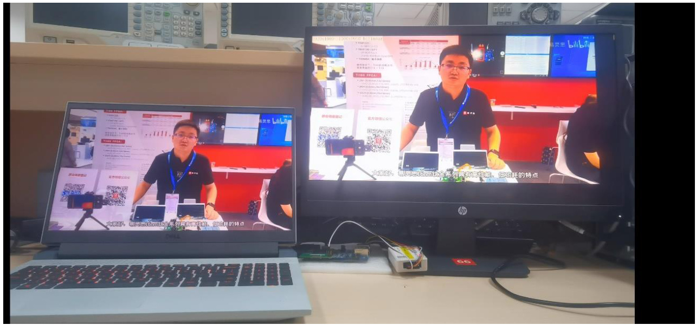
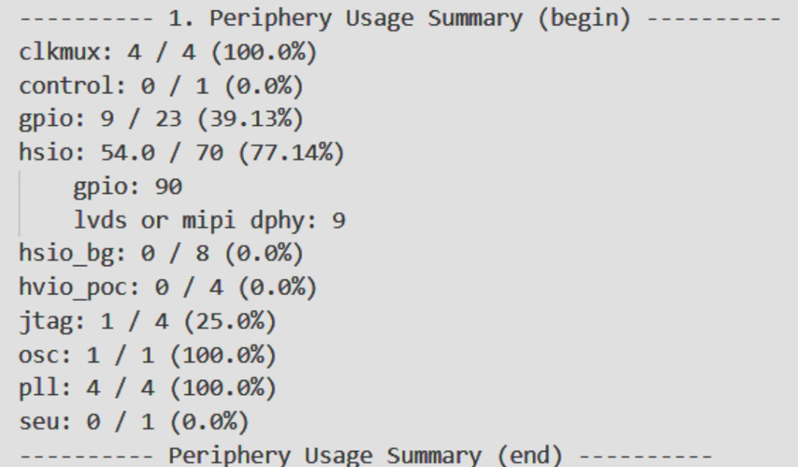

**English | [简体中文](README_cn.md)**
<div id="top"></div>

[![Contributors][contributors-shield]][contributors-url]
[![Forks][forks-shield]][forks-url]
[![Stargazers][stars-shield]][stars-url]
[![Issues][issues-shield]][issues-url]
[![License][license-shield]][license-url]


<!-- PROJECT LOGO -->
<br />
<div align="center">
    <a href="https://github.com/MoonGrt/VisionZoom">
    
    </a>
<h3 align="center">VisionZoom</h3>
    <p align="center">
    High-definition video streaming transmitter VisionZoom Pro is applied to tasks involving arbitrary scale zooming and field of view panning. The project adopts median filtering and edge detection techniques to enhance the comfort and stability of the video, and fully utilizes the RISC-V core of Elitestek along with computer host communication for user feedback.
    <br />
    <a href="https://github.com/MoonGrt/VisionZoom"><strong>Explore the docs »</strong></a>
    <br />
    <a href="https://github.com/MoonGrt/VisionZoom">View Demo</a>
    ·
    <a href="https://github.com/MoonGrt/VisionZoom/issues">Report Bug</a>
    ·
    <a href="https://github.com/MoonGrt/VisionZoom/issues">Request Feature</a>
    </p>
</div>


<!-- CONTENTS -->
<details open>
  <summary>Contents</summary>
  <ol>
    <li><a href="#file-tree">File Tree</a></li>
    <li>
      <a href="#about-the-project">About The Project</a>
      <ul>
      </ul>
    </li>
    <li><a href="#contributing">Contributing</a></li>
    <li><a href="#license">License</a></li>
    <li><a href="#contact">Contact</a></li>
    <li><a href="#acknowledgments">Acknowledgments</a></li>
  </ol>
</details>


<!-- FILE TREE -->
## File Tree

```
└─ Project
  ├─ LICENSE
  ├─ README.md
  ├─ /Efinity_Project/
  │ └─ /source/
  │   ├─ /algorithm/
  │   │ ├─ algorithm.v
  │   │ ├─ fifo.v
  │   │ ├─ fill_brank.v
  │   │ ├─ image_cut.v
  │   │ ├─ ramDualPort.v
  │   │ ├─ ramFifo.v
  │   │ ├─ ram_char.v
  │   │ ├─ ram_char1.v
  │   │ ├─ ram_init_file.inithex
  │   │ └─ streamScaler.v
  │   ├─ /frame_buffer/
  │   ├─ /hdmi_in/
  │   ├─ /hdmi_src/
  │   │ ├─ /dvi_rx/
  │   │ └─ /dvi_tx/
  │   ├─ /soft_ddr3/
  │   ├─ /top_module/
  │   │ └─ example_top.v
  │   └─ /yuv_2rgb/
  ├─ /GUI/
  │ ├─ GUI_V3.py
  │ └─ /Image/
  ├─ /Outflow/
  └─ /Document/

```


<!-- ABOUT THE PROJECT -->
## About The Project

### Part I Design Overview

#### 1.1 Design Purpose

Video and streaming media, as the most intuitive form of information transmission, have always been at the forefront of the development of information technology. With the development of VR and other technologies, how to efficiently deliver video-type files in high-definition has become an urgent problem. Through comprehensive research in our group [1, 2], we develop the HD video-streaming transmitter VisionZoom Pro and apply it to the tasks of arbitrary scale scaling and field of view panning. Meanwhile, in order to provide a better user experience, we adopt median filtering and edge detection techniques to enhance video comfort and stability, and make full use of RISC-V cores and UART transmission for user feedback. Based on the platform provided by Elinks, our VisionZoom Pro and the accompanying GUI interface provide a high-performance, high-experience technical implementation.

#### 1.2 Application Areas

Our VisionZoom Pro is used in a wide variety of applications. Firstly, in traditional conferencing, VisionZoom Pro provides high-quality video resources with low latency, zero blurring, and plug-and-play, which ensures that participants in different network environments can have a good video experience. Secondly, in medical image processing, VisionZoom Pro provides a new way of analysing medical images such as X-rays, CT scans and fMRIs in video format for doctors. Additionally, in the military, real-time processing and scaling of video improves the efficiency of surveillance and reconnaissance. Finally, VisionZoom Pro also has great potential in the virtual reality (VR) and meta-universe fields, where real-time scaling technology enables users to resize images in a virtual display experience to improve the clarity and realism of the content, providing a better visual experience on both PCs and head-mounted devices.

#### 1.3 Key Technical Features

In the development of VisionZoom Pro, our team has used a variety of technologies, the most important innovation is in the information transfer and information processing module. For information transfer, we use HDMI signals as the encoding form in the FPGA, which is the most abundant and widely used interface by users. Through the use of Titanium Series DDR3 IP, the AXI4 full-speed mode is achieved, which dramatically increases the data transfer rate up to 1000Mbps; through the fully parameterised design, it is compatible with DDR3 SDRAM compliant with JESD79-3 standard, which provides a high degree of portability. The transmission of algorithmic control signals is based on RISC-V core and UART protocol, and the current state of the device is fed back to the user on the screen in time to create a good interactive experience. In the algorithm section, our main technology is divided into the pixel processing module, which contains two algorithms: nearest-neighbour interpolation and bilinear interpolation, and the image processing module, which is mainly based on median filtering and edge detection algorithms. The two algorithms in the pixel processing module can be reasonably switched by the data transmitted from the UART, making full use of the parallelism of the FPGA to achieve efficient scaling. Meanwhile, the median filtering and edge detection algorithms can reduce the loss of ambient noise in the data transmission process and effectively alleviate the problems of edge jaggedness and edge blurring caused by the pixel processing module.

#### 1.4 Key Performance Indicators

Image Quality Evaluation: As the input and output of the system, the image quality is the most important index for judging the system. In order to make a comprehensive evaluation of image quality, we divide the overall evaluation criteria into subjective and objective parts. The objective evaluation criteria mainly focus on some sensible parameters and the overall image rendering effect, and we selected the peak signal-to-noise ratio (PSNR) as a parameter for quantitative evaluation [1, 2]; at the same time, we evaluated the image quality by whether it produces jaggedness or not, whether the edges of the objects are blurred or not and whether it appears to be a flickering screen or not. As for the subjective parameters, we mainly conducted user-oriented experiments, and the evaluation criteria were based on the viewing comfort of the same image, whether the eyes felt fatigue, whether the colours were attenuated, and whether the edges were blurred, which gave a combined perception score, and finally, together with the objective scores, constituted our evaluation of the image quality. Our bilinear interpolation and nearest-neighbour PSNR were measured to be 22.3 and 22.9, respectively.

Processing speed and latency: Another very important indicator for the evaluation of video streaming is the smoothness of the picture. The latency of the VisionZoom Pro system is imperceptible to the naked eye, and the measured frame rates are $60\mathrm{Hz}$ under ideal conditions.

Resource Utilisation: Fully utilise the performance and resources of FPGA hardware acceleration to avoid ineffective resource usage and excessive resource vacancy.

#### 1.5 Main Innovations

(1) Add two digital filters based on the classical algorithm of nearest neighbour interpolation and bilinear interpolation algorithm to reduce noise and other interferences and improve system robustness.

(2) The use of RAM FIFO: In order to calculate the coefficients required by the interpolation algorithm and store the four pixel values around the interpolation point, we adopt the method of using two rows of buffers, but a large amount of data caching will lead to an increase in latency, and the use of the ping-pong rotation mechanism will increase the hardware requirements. Therefore, we use a FIFO buffer with RAM as the element to store the data.

(3) Arbitrary scaling, either expanding any size to the full screen or reducing the full screen to any resolution, which can be done through the GUI interface provided for the user.

(4) Serial commands can be used to process a part of the image, and local zoom can be adapted to the needs of multiple scenes.

(5) Bilinear and nearest-neighbour are selected in the same module through a multiplexer, and the user can select the algorithm to be used through the GUI interface.

### Part II System Composition and Functional Description

#### 2.1 Overall Introduction

The overall system block diagram of our video streaming scaler is shown below:


<div style="text-align: center;">Figure 1. Overall Block Diagram of the System</div>

According to the design purpose, our video streaming scaling system needs to achieve three basic requirements: low latency, high picture quality and arbitrary scaling effect. For a complete frame transmission process, the initial image resolution information is 1920*1080 and $60\mathrm{Hz}$ sent from the PC as the input source to the FPGA through the IIC configuration module. After the communication is established, the pixel information is divided into three 10-bit colour channels through the HDMI input and output. Such input and output requirements require us to add a codec conversion module between the input and output of the 10-bit colour channels and the three 8-bit RGB channels. The eight-bit RGB data obtained through decoding is input into the algorithm module that contains preprocessing and interpolation to complete the image to achieve the scaling function, and finally display the frame on the monitor through HDMI. The data cache part of the system needs to cache three frames of scaled image data, and the DDR3 module we use selects 16-bit input, so before inputting into the cache module, it is necessary to convert the three channels of 24-bit colour data into 16-bit yCbCr format, and carry out the yuv444 to yuv422 conversion to reduce the space required for storing the data, while retaining the good quality of the video pixel points. The space required for storage is reduced while retaining the good quality of the video pixels.

Based on the basic engineering of scaling, we use an Elinks RISC-V Sapphire SoC to receive user control information from the PC host. We configured the IP Sapphire SoC softcore to operate at 50MHz and enabled its UARTs and corresponding interrupts, while leaving the rest of the components at default. In more detail, the host computer sends a string of data to the Ti60F225, and the RISC-V softcore receives the data, decodes the corresponding video parameters, and writes the obtained parameters to the corresponding locations in the DDR. Whenever the frame synchronisation signal comes, the algorithm part will read the video parameters stored in the DDR and adjust the input and output of the algorithm accordingly. The parameters decoded by the UART are converted into control signals for specific algorithms and modes to guide the video streaming output of the system.

#### 2.2 Introduction of each module

##### 2.2.1 hdmi_rx/ hdmi_tx module


<div style="text-align: center;">Figure 2. DVI Decoder Schematic</div>

At the moment of power-on, the computer reads the EDID data structure stored in the ROM of the Ti60F225 through the DDC channel of the HDMI via the IIC protocol, so as to obtain the reception capability and reception characteristics of the Ti60F225: such as the screen resolution, frame rate, and colour settings, etc. The computer sends the video stream with the corresponding resolution in hmdi timing sequence. The computer sends the video stream to the Ti60F225 in the hmdi timing sequence corresponding to the resolution. hmdi is used for the video streaming to the Ti60F225.

After the hdmi_rx module receives the streaming video data, the DVI decoder determines the location of the data boundaries in a series of serial data. The TMDS word contains five or fewer transitions when it is processed in the data cycle and data island cycle of the video data, and seven or more transitions when it is processed in the control cycle. These differences in the number of character jumps will be used to synchronise the boundaries. Once the boundaries have been determined, the parallel data converted by the serial-to-parallel converter is decoded in 8B/10B to obtain the pixel data and associated control signals. Finally, four signals, hs, vs, de, and data, are generated and passed to the algorithm module.

##### 2.2.2 algorithm module


<div style="text-align: center;">Figure 3. Block diagram of the algorithmic part of the module</div>

In the frame image scaling algorithm section, the first step is to get the zoom-in and zoom-out mode selection through the serial port data. If it is zoom-in mode, the user-specified part of the input source video image is intercepted (the range of cutting is determined by the horizontal and vertical coordinates of the start and end points), which is realised by the execution of the original frame cutting module; if it is zoom-out mode, the input source video image is scaled down to the size of the output resolution specified by the user. Considering the need to read two lines of data and write one line of data in the algorithm, we use asynchronous read and write FIFOs using different clock frequencies to complete. Through the user's choice, the algorithm implementation module specifically selects the nearest neighbour or bilinear interpolation to achieve the specific function and before and after the implementation of the algorithm, the image data input and output are used to reduce the interference of noise signals filtering module [3]. In the implementation of the reduction algorithm, the reduced input image will be displayed in the upper left corner of the HDMI display, so the blanking module will be used to display the empty part of the screen in black to prevent the phenomenon of splash screen. Through the use of joining filter module and not join the filter module of the project using the colour bar COLOR ___ BAR simulation comparison, the lack of filter module, view the simulation results in the pixel data values, found in each line of data there will be part of the real data data inconsistent data such as non-ideal 0 value; on the board to verify that whether to join the filter module whether the significant practical effect, and concluded that if the filter module is added to the HDMI display, the blanking module will be displayed in black to prevent the emergence of flickering screen. It is concluded that if the filter module is missing, dozens of black dotted lines will appear in the output video stream image, and there are many irregularly arranged black dots or green noise in the adjacent dotted lines.

##### 2.2.3 frame buffer module


<div style="text-align: center;">Figure 4. Frame Buffer Module Block Diagram</div>

In DDR3 write timing, the host sends address and control information to the write address channel, and then the host sends each write data to the write data channel. When the host sends the last data, the ‘LAST’ signal is pulled. After the device accepts all the data, there will be a write corresponding command signal sent back to indicate that the write transaction is complete.DDR3 read timing, when the address appears in the data bus, the transmitted data will appear in the read data channel, the device has been to keep the device data is invalid to know that the read data is valid. The processor may need to access the DDR3 memory to read or write data, and this access needs to be done through an efficient bus protocol - AXI (Advanced eXtensible Interface).AXI is a high-performance, high-bandwidth bus protocol for connecting and communicating with various hardware components in a digital system. connecting and communicating various hardware components in digital systems [4]. We call the Titanium series DDR3 IP core provided by Elinks to implement AXI4 full-speed mode and auto-calibration through the soft core (in our project, we can configure the configuration to see whether the self-calibration is successful or not by whether the LED is blinking or not, so that it is easy to check).

##### 2.2.4 Upper transmitter module - customer-friendly architectural design

In order to facilitate the use of our products, we have made a beautiful and easy to use human-computer interface, the user can open the serial port transmission function after selecting the correct serial port and select the appropriate transmission baud rate and zoom in or out mode through the drop-down menu bar; by clicking on the corresponding algorithms in front of the hollow dot, as shown in the figure below:


<div style="text-align: center;">Figure 5. Select via radio or drop-down menu bar</div>

After selecting one of the zoom-in or zoom-out modes, the parameter selection related to the other function will become dark grey and you cannot input or drag the slider bar; for the selected mode, you can drag the slider bar arbitrarily to select the pixel coordinates or the reduced resolution value, as shown in Fig. The displayed video stream will be zoomed to 1920*1080 by cutting out the upper-left quarter of the image from the resolution; the upper-left quarter will be zoomed to 1920*1080; and the remaining part of the display will be filled with black pixel dots. zoom out from 1920*1080 to 800*600 and fill the empty part of the display with black pixels.

### Part III Completion and Performance Parameters

#### 3.1 Simulation Waveforms

Enlargement: Here, we set the setting to cut out the middle 1/2 part of each frame of the video stream and enlarge the cut out image to twice of the original one.


<div style="text-align: center;">Figure 6. Simulation results of bilinear interpolation algorithm Fig.</div>


<div style="text-align: center;">Figure 7. Nearest Neighbour Algorithm Simulation Result Plot</div>

A colour bar video streaming module (480*272) is exemplified before the algorithm module to mimic the video stream passed to the algorithm by the pc. Firstly, the video stream passes through the image cutter module, which cuts out each frame of the original video stream from the pc to the part that the user wants to zoom in. From the simulation results, we can see that the image cutting module (de_o, vs_o, rgb_o) correctly cuts out the part that the user wants to zoom in from the original images (hs_i, vs_i, de_i, rgb_i).

The scaling algorithm module contains three dual-port RAMs to access the stored video pixel data. From the simulation image, it can be seen that when the algorithm module has correctly hosted two lines of image data, the module will calculate the image data that should be output. Since the algorithm is simply set to expand the input image by a factor of two, the algorithm outputs two rows of pixels for every row of image data accessed after reading two rows of data from the beginning. (Here the algorithm uses 2x clock)

To show the simulation result of zooming in at an arbitrary scale: 159*146->480*272.


<div style="text-align: center;">Figure 8. Arbitrary scale enlargement of the simulation results</div>

Demonstrate arbitrary scaling down: 480*272->253*123


<div style="text-align: center;">Figure 9. Arbitrarily scaled down simulation results</div>

The simulation results show that the algorithm module supports any scale up to 2 times and any scale down.

#### 3.2 Image Simulation Results

Our algorithm supports a wide range of resolution from image scaling, considering the length of the document report, here we use the small resolution image scaling results as the result verification. The simulation result graph is placed in Document/demos.

#### 3.3 Actual Waveform Demonstration

The result of zooming the centre area to 1920*1080 resolution signal grabbing is shown in Figure 10:


<div style="text-align: center;">Figure 10. The actual pulling of the data output from the algorithm and the data_valid waveforms</div>

#### 3.4 Platform building


<div style="text-align: center;">Figure 11. Actual display platform construction</div>

We use the Efinity EDA tool as the development environment for verification and demonstration on the FPGA chip Ti60F225. The overall platform is shown in Figure 11, including the FPGA development board, PC input source, monitor, JTAG downloader, HDMI cable and power cable, etc. The FPGA outputs the input source image to the monitor after filtering and interpolation through engineering algorithms. For the zoom-out mode, we choose to zoom out from 1920*1080 to 1800*950 and 960*950; for the zoom-in mode, we firstly choose the central area of the screen, i.e., the area of 960*540 with the coordinates of the start point (280, 1440) and the end point (270, 810), and zoom in to the full-screen of the monitor 1920*1080. 1920*1080$. To show that we can zoom in and out arbitrarily, we randomly select a rectangular area of 1272*0737 with the start point at the far point and zoom in to the full screen. As shown in Figure. 20, Figure. 21, Figure. 22, Figure 15., the result is ideal, the image edges are clear without jaggedness and blurring, there is almost no delay and no lag, and the colour channels are displayed normally.


<div style="text-align: center;">Figure 12. 1920*1080 -> 1800*950</div>


<div style="text-align: center;">Figure 13. 1920\*1080->960\*950</div>


<div style="text-align: center;">Figure 14. Central area of the image  960*540->1920*1080</div>


<div style="text-align: center;">Figure 15. 1272*737->1920*1080</div>

#### 3.5 Resource utilisation


<div style="text-align: center;">Figure 16. Overall system RTL diagram</div>


<div style="text-align: center;">Figure 17. RAM, register resource usage report</div>


<div style="text-align: center;">Figure 18. Memory and IO Pin Resource Usage during Layout</div>


<div style="text-align: center;">Figure 19. Overall resourcing</div>

As can be seen in Figure 18, both Memory Blocks and DSP Blocks take up a small amount of 32.42 and 18.12 respectively, proving the effectiveness of the algorithm when the real-time scaling effect is fully realised. From the overall engineering report, we can see that the clock frequency allocation was maximised to 100. These documented reports provide important data support for our team to improve the project and help us to continuously plan and optimise the project to avoid excessive idle resources or resource bottlenecks.

#### 3.6 Subjective and objective performance metrics assessment

Objective evaluation metrics: Quantitative analysis: Peak Signal-to-Noise Ratio (PSNR)

Peak Signal to Noise Ratio is an assessment of the quality of a scaled image based on the difference in pixel values between the image and the algorithmically processed output image at the same coordinates, usually expressed in decibels (dB). It is a logarithmic expression of the ratio between the maximum possible pixel value and the mean square error (MSE) between two images. The larger this value, the less image distortion is indicated. The expression is

$$
\mathrm{PSNR}=10\log_{10}\left(\frac{(2^{n}-1)^{2}}{\mathrm{MSE}}\right)
$$

Where MSE stands for Mean Square Error and $\mathbf{n}$ is the number of bits in the pixel value. It can be calculated by the following equation:

$$
{\mathsf{M S E}}={\frac{1}{M\times N}}\sum_{m=0}^{M-1}\sum_{n=0}^{N-1}[f(m,n)-g(m,n)]^{2}
$$

The difference in the results of different algorithms is compared by comparing the different results obtained by bilinear interpolation and nearest neighbour algorithm with the source image respectively. Since PSNR is usually used to compare two images of the same size and the size of the image before and after scaling is different from that of the source image, it is necessary to downsample a certain percentage of the source image and then scale it up to the same resolution as the source image by different

algorithms to the same resolution as the source image. The calculation script is included in the appendix, and the PSNR and MSE values can be obtained by specifying the path to the input source image and the resolution value after scaling.

Calculated by taking the zoom demonstrated in the previous section as an example:
| zoom ratio | nearest neighbour interpolation | bilinear interpolation |
|----------|------------|------------|
| 1/2      | 27.8       | 29.6       |
| 1/4      | 22.9       | 22.3       |


Comparison of the tables shows that it is generally accepted that if the PSNR value is higher than 36, the human eye cannot distinguish the image differences, and if it is higher than 24, the image differences can be considered as negligible [1, 2]. It is concluded that both algorithms responded to the desired performance and the bilinear interpolation outperformed the nearest neighbour interpolation algorithm in the test.

Qualitative Analysis
| | Nearest Neighbour Interpolation | Bilinear Interpolation | Nearest Neighbour Interpolation (preprocessed) | Bilinear Interpolation (preprocessed) |
|--------------------------|------------|------------|-------------------------|-------------------------|
| Whether jaggedness is generated | Jaggedness is generated | No | No | No | No | No
| Are object edges blurred | slightly blurred | slightly blurred | no | no |
| Does a splash screen appear | No | No | No | No | No | No


### Part IV Conclusion

The Ti60F225 development board we used in this competition supports 1.5Gbps MIPI CSI and DSI, which is used in highly integrated mobile and edge devices that require low power consumption, small form factor, and multiple I/Os, and is very suitable for the AI Internet domain. Therefore, super-resolution, old film restoration is the part we are ready to extend by accelerating classical super-resolution algorithms such as SRCNN (Super-Resolution Convolutional Neural Network) through this low-power hardware and transferring the image data using a high-speed interface. Repair of old movies also need video processing techniques, such as filtering and denoising, we are currently using digital filters and other modules with high reusability can save resources and save development cycles; old movies often have a low frame rate, you can use frame interpolation techniques to increase the frame rate to improve the smoothness of the video. Common algorithms and linear interpolation, inserting a new frame between neighbouring frames, each pixel of the new inserted frame takes its value from the corresponding pixel value of the previous and previous frames of the linear interpolation, and the two-dimensional linear interpolation method used in the single-frame image we adopt has a high degree of similarity [5]. Therefore, adding the AI algorithm to achieve video super-resolution is an extension step that we are gradually implementing after completing the scaling of arbitrary scale video streaming.

### Part V References

[1] Yikai Wang. FPGA hardware implementation of real-time video image scaling system[D]. North Central University, 2023.DOI:10.27470/d.cnki.ghbgc.2023.000987.

[2] Wu, Yi-Kai. Design and implementation of video scaling based on FPGA[D]. Jiangsu University,2018.

[3] Bongsoon Kang, Jun Sunwoo, Byung-Hwan Chun and J. Gerard, "Improved  performance of video decoder using down scaler and adaptive comb filter,"  ISCE '97.  Proceedings of 1997 IEEE International Symposium on Consumer Electronics (Cat.  No.97TH8348) , Singapore, 1997, pp. 47-50, doi: 10.1109/ISCE.1997.658348.

[4] M. Gupta and A. K. Nagawat, "Design and implementation of high performance  advanced extensible interface(AXI) based DDR3 memory controller,"  2016  International Conference on Communication and Signal Processing (ICCSP) ,  Melmaruvathur, India, 2016, pp. 1175-1179, doi: 10.1109/ICCSP.2016.7754337.

[5] H. Okuhata, M. Ise, R. Y. Omaki and I. Shirakawa, "Implementation of superresolution scaler for Full HD and 4K video,"  2013 IEEE Third International  Conference on Consumer Electronics ¿ Berlin (ICCE-Berlin) , Berlin, Germany, 2013,  pp. 1-5, doi: 10.1109/ICCE-Berlin.2013.6697987.

[6] Miao Li , Wang Yuyu , Yu Xiaoyan . Implementation of bilinear interpolation video scaling algorithm based on FPGA [J]. Information and Computer (Theoretical Edition),2021,33(08):84-86.

<p align="right">(<a href="#top">top</a>)</p>


<!-- CONTRIBUTING -->
## Contributing

Contributions are what make the open source community such an amazing place to learn, inspire, and create. Any contributions you make are **greatly appreciated**.
If you have a suggestion that would make this better, please fork the repo and create a pull request. You can also simply open an issue with the tag "enhancement".
Don't forget to give the project a star! Thanks again!
1. Fork the Project
2. Create your Feature Branch (`git checkout -b feature/AmazingFeature`)
3. Commit your Changes (`git commit -m 'Add some AmazingFeature'`)
4. Push to the Branch (`git push origin feature/AmazingFeature`)
5. Open a Pull Request
<p align="right">(<a href="#top">top</a>)</p>


<!-- LICENSE -->
## License

Distributed under the MIT License. See `LICENSE` for more information.
<p align="right">(<a href="#top">top</a>)</p>


<!-- CONTACT -->
## Contact

MoonGrt - 1561145394@qq.com
Project Link: [MoonGrt/VisionZoom](https://github.com/MoonGrt/VisionZoom)

<p align="right">(<a href="#top">top</a>)</p>


<!-- ACKNOWLEDGMENTS -->
## Acknowledgments

* [Choose an Open Source License](https://choosealicense.com)
* [GitHub Emoji Cheat Sheet](https://www.webpagefx.com/tools/emoji-cheat-sheet)
* [Malven's Flexbox Cheatsheet](https://flexbox.malven.co/)
* [Malven's Grid Cheatsheet](https://grid.malven.co/)
* [Img Shields](https://shields.io)
* [GitHub Pages](https://pages.github.com)
* [Font Awesome](https://fontawesome.com)
* [React Icons](https://react-icons.github.io/react-icons/search)
<p align="right">(<a href="#top">top</a>)</p>


<!-- MARKDOWN LINKS & IMAGES -->
<!-- https://www.markdownguide.org/basic-syntax/#reference-style-links -->
[contributors-shield]: https://img.shields.io/github/contributors/MoonGrt/VisionZoom.svg?style=for-the-badge
[contributors-url]: https://github.com/MoonGrt/VisionZoom/graphs/contributors
[forks-shield]: https://img.shields.io/github/forks/MoonGrt/VisionZoom.svg?style=for-the-badge
[forks-url]: https://github.com/MoonGrt/VisionZoom/network/members
[stars-shield]: https://img.shields.io/github/stars/MoonGrt/VisionZoom.svg?style=for-the-badge
[stars-url]: https://github.com/MoonGrt/VisionZoom/stargazers
[issues-shield]: https://img.shields.io/github/issues/MoonGrt/VisionZoom.svg?style=for-the-badge
[issues-url]: https://github.com/MoonGrt/VisionZoom/issues
[license-shield]: https://img.shields.io/github/license/MoonGrt/VisionZoom.svg?style=for-the-badge
[license-url]: https://github.com/MoonGrt/VisionZoom/blob/master/LICENSE

