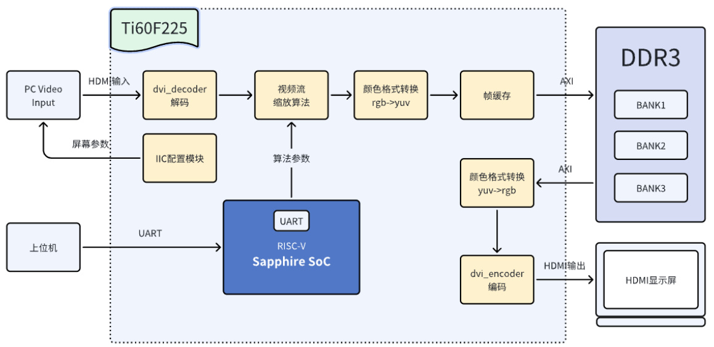
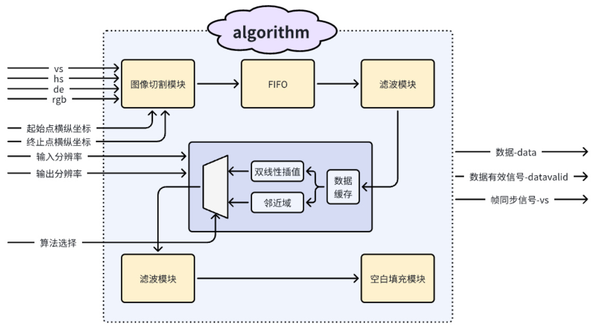
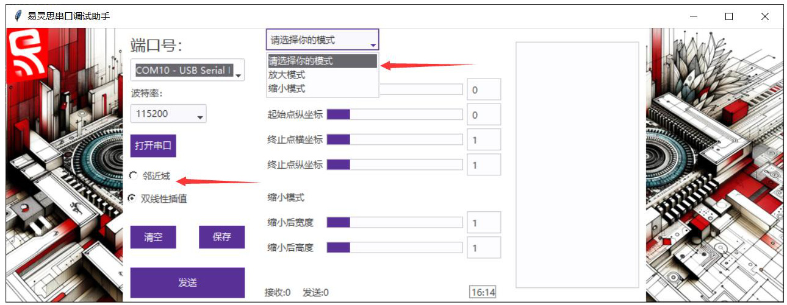
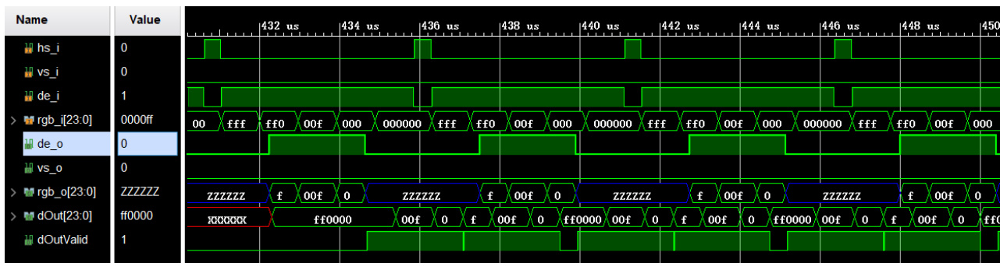
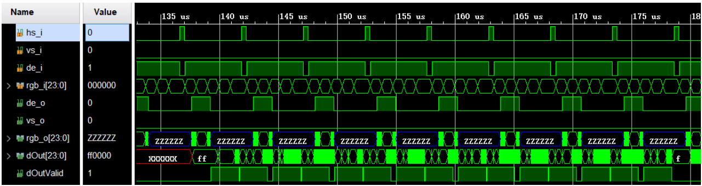
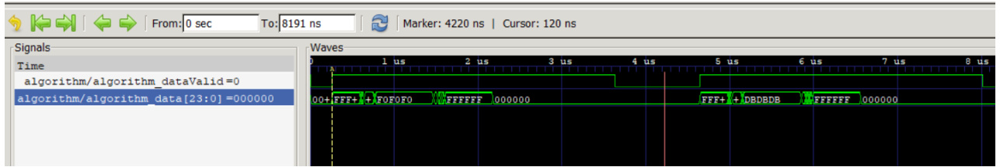
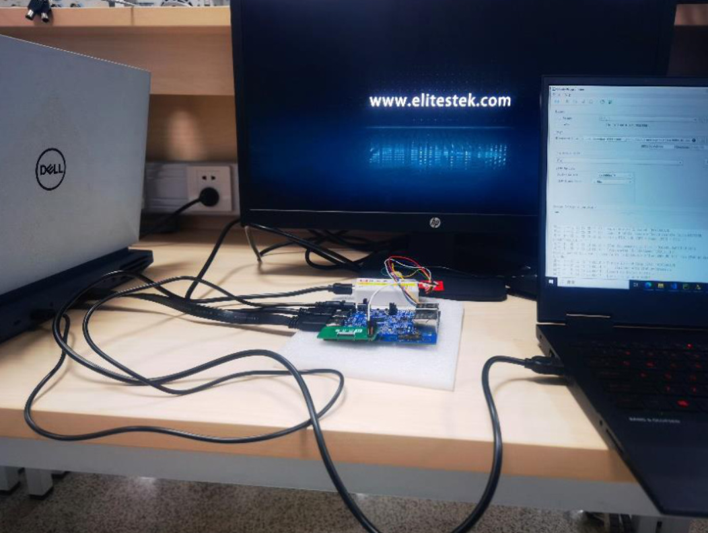
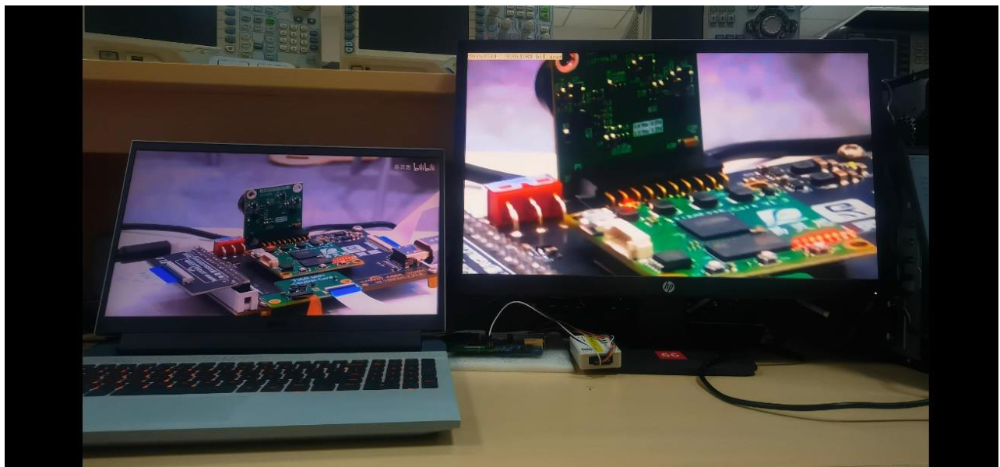
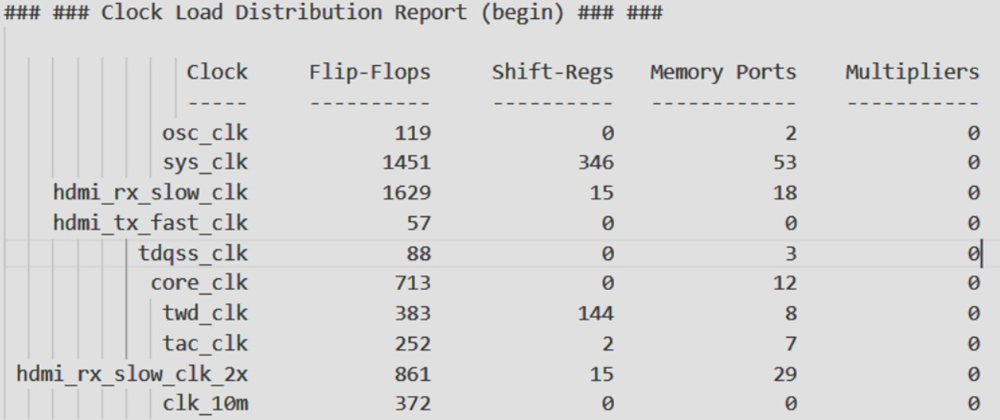

**简体中文 | [English](README.md)**
<div id="top"></div>

[![Contributors][contributors-shield]][contributors-url]
[![Forks][forks-shield]][forks-url]
[![Stargazers][stars-shield]][stars-url]
[![Issues][issues-shield]][issues-url]
[![License][license-shield]][license-url]


<!-- PROJECT LOGO -->
<br />
<div align="center">
    <a href="https://github.com/MoonGrt/VisionZoom">
    
    </a>
<h3 align="center">VisionZoom</h3>
    <p align="center">
    高清视频流传输器 VisionZoom Pro 适用于涉及任意比例缩放和视场平移的任务。该项目采用了中值滤波和边缘检测技术来提高视频的舒适性和稳定性，并充分利用了 Elitestek 的 RISC-V 内核和计算机主机通信来实现用户反馈。
    <br />
    <a href="https://github.com/MoonGrt/VisionZoom"><strong>浏览文档 »</strong></a>
    <br />
    <a href="https://github.com/MoonGrt/VisionZoom">查看 Demo</a>
    ·
    <a href="https://github.com/MoonGrt/VisionZoom/issues">反馈 Bug</a>
    ·
    <a href="https://github.com/MoonGrt/VisionZoom/issues">请求新功能</a>
    </p>
</div>


<!-- CONTENTS -->
<details open>
  <summary>目录</summary>
  <ol>
    <li><a href="#文件树">文件树</a></li>
    <li>
      <a href="#关于本项目">关于本项目</a>
      <ul>
      </ul>
    </li>
    <li><a href="#贡献">贡献</a></li>
    <li><a href="#许可证">许可证</a></li>
    <li><a href="#联系我们">联系我们</a></li>
    <li><a href="#致谢">致谢</a></li>
  </ol>
</details>


<!-- 文件树 -->
## 文件树

```
└─ Project
  ├─ LICENSE
  ├─ README.md
  ├─ /Efinity_Project/
  │ └─ /source/
  │   ├─ /algorithm/
  │   │ ├─ algorithm.v
  │   │ ├─ fifo.v
  │   │ ├─ fill_brank.v
  │   │ ├─ image_cut.v
  │   │ ├─ ramDualPort.v
  │   │ ├─ ramFifo.v
  │   │ ├─ ram_char.v
  │   │ ├─ ram_char1.v
  │   │ ├─ ram_init_file.inithex
  │   │ └─ streamScaler.v
  │   ├─ /frame_buffer/
  │   ├─ /hdmi_in/
  │   ├─ /hdmi_src/
  │   │ ├─ /dvi_rx/
  │   │ └─ /dvi_tx/
  │   ├─ /soft_ddr3/
  │   ├─ /top_module/
  │   │ └─ example_top.v
  │   └─ /yuv_2rgb/
  ├─ /GUI/
  │ ├─ GUI_V3.py
  │ └─ /Image/
  ├─ /Outflow/
  └─ /Document/

```


<!-- 关于本项目 -->
## 关于本项目

### 第一部分  设计概述

#### 1.1 设计目的

视频与流媒体作为最直观的信息传输形式，一直是信息技术发展的前沿，随着VR 等技术的发展，视频类文件如何高效高清的传递成为了亟待解决的问题。本小组通过全面研究 [1, 2]，我们开发高清视频-流媒体传输器VisionZoom Pro，并应用于任意比例缩放与视野平移的任务。同时，为了使用户获得更佳的体验，我们采用了中值滤波技术与边缘检测技术来强化视频的舒适性与稳定性，并充分使用了RISC-V 核与UART 传输进行用户的反馈。基于易灵思提供的平台，我们的VisionZoom Pro 及配套的GUI 界面，提供高性能优体验的技术实现。

#### 1.2 应用领域

我们的产品VisionZoom Pro 在各领域上的应用广泛多样。首先，在传统的会议中VisionZoom Pro 提供优质的视频资源做到低延迟，零模糊，即插即用，确保不同网络环境下的参会者都能获得良好的视频体验。其次，在医疗影像处理方面，VisionZoom Pro 提供了新方法，将X 射线、CT 扫描和fMRI 等医学图像以视频形式助力医生分析。此外，在军事方面，通过视频的实时处理和缩放，提升了监视和侦察的效率。最后，VisionZoom Pro 在虚拟现实（VR）和元宇宙领域同样具有巨大潜力，通过实时缩放技术，用户能够调整虚拟显示体验中的图像大小，提高内容的清晰度和逼真感，无论是在PC 端还是头戴式设备上，都能为用户提供更佳的视觉体验。

#### 1.3 主要技术特点

本小组在VisionZoom Pro 的开发过程中，运用了各式各样的技术，其中最主要的创新点在信息传递与信息处理模块上。在信息的传递上，我们采用HDMI 信号作为编码形式在FPGA 中传入传出，这是最大量的最广泛被用户使用的接口方式。通过钛金系列DDR3 IP 的使用，达到AXI4 全速模式，大幅度提高数据传输速率，高达1000Mbps;通过完全参数化的设计，可与符合JESD79-3 标准的DDR3 SDRAM 兼容，具有高可移植性。而算法控制信号的传输则是基于RISC-V 核与UART 协议进行的，并将当前设备状态及时在屏幕上反馈给用户，营造良好的交互体验。而在算法部分，我们的主要技术点分为包含最近邻插值与双线性插值两种算法的像素处理模块，以及以中值滤波与边缘检测算法为主体的图像处理模块。像素处理模块中的两种算法能够通过UART 传输的数据进行合理的切换，充分利用 FPGA  的并行性，实现高效的缩放处理。同时，中值滤波 与边缘检测算法能够降低环境噪音在数据传输过程中的损失同时也有效的缓解了像素处理模块造成的边缘锯齿与边缘模糊的问题。

#### 1.4   关键性能指标

图像质量评价：图像作为系统的输入和输出两个关键部分，图像质量是对于系统的评判最重要的指标。为了对图像质量进行全面的评定，我们将整体的评价标准分为主观和客观两部分。客观评价标准主要聚焦于一些可感的参数与图像整体呈现效果，我们选取了峰值信号比（PSNR）作为参数进行量化评价 [1, 2]；同时，通过是否产生锯齿，物体边缘是否模糊，以及是否出现闪屏。而主观的参数，我们主要进行面向用户的实验，评价标准基于相同画面的观看舒适度，眼睛是否感觉疲劳，色彩是否有衰减，以及是否存在边缘模糊，综合给出感受分，最终与客观评分一起构成我们对图像质量的评价。经测量，我们的双线性插值与最近邻算 法PSNR 分别达到了22.3 与22.9。

处理速度与延迟：对于视频流媒体的评价，另一个极为重要指标的是画面的流畅度。经过VisionZoom Pro 系统的延迟是肉眼无法察觉的，而测量出的帧率均为理想情况下的 60Hz。

资源利用率：充分利用FPGA 硬件加速的性能和资源，避免无效占用资源与过度资源空置。

#### 1.5 主要创新点

(1) 在经典算法最近邻插值和双线性插值算法的基础上增加两个数字滤波器，减小噪声等干扰，提高系统鲁棒性。

(2) RAM FIFO 使用：为计算插值算法所需要的系数和存储插值点周围的四个像素值，采取方法为使用两个行缓冲，但是大量数据缓存会导致延时增加；采用乒乓轮换机制则又增加了硬件需求。因此我们采用以RAM 为元素的FIFO 缓冲区存储数据。

(3) 任意倍数缩放，既可以将任意大小扩大至全屏，也可将全屏缩小至任意 分辨率，均通过为用户提供的GUI 界面完成。

(4) 用串口指令实现对图像某一部分进行处理，实现对图像局部放大可适应多场景需求

(5) 双线性和最近邻在同一个模块内通过多路调制器进行选择，用户可通过GUI 界面选择使用的算法。

### 第二部分  系统组成及功能说明

#### 2.1   整体介绍

我们的视频流媒体缩放器的系统整体框图如下所示：


<div style="text-align: center;">Figure 1. 系统整体框图</div>

按照设计目的，我们的视频流媒体缩放系统需要做到低延迟，高画质和任意比例缩放效果三个基本需求。对于一个完整帧传输过程，首先是通过IIC 配置模块，由PC 端作为输入源向FPGA 发送的初始图像分辨率信息为 1920*1080， 60Hz。在建立通信后，通过HDMI 输入输出将像素信息分为三个10 位的颜色通道，这样的输入输出要求则要求我们在输入与输出之间增加十位颜色通道与三个八位RGB 通道的编解码转换模块。通过译码得到的八位RGB 数据输入包含预处理与插值的算法模块补全图像完成缩放功能的实现，并最终通过HDMI将本帧图像显示在显示器上。本系统的数据暂存部分需要缓存三帧缩放后的图像数据，而我们采用的DDR3 模块选择了16 位输入，因此在输入缓存模块之前需要将三通道共24 位的颜色数据转换成16 位的yCbCr 格式并进行yuv444到yuv422 的转换用以减小在保留良好视频像素点质量的情况下减小存储需要的空间。

在实现了缩放的基础工程的基础上，我们使用易灵思RISC-V 软核Sapphire SoC来接取来自电脑上位机传来的用户控制信息。我们将IP Sapphire SoC 软核的主频配置为50MHz，并使能其UART 以及对应的中断功能，而其他部件保持默认。更具体的使用过程中，由上位机向Ti60F225 发送一串数据，RISC-V 软核接收到数据后解码出相应的视频参数，并将得到的参数写入DDR 的相应位置。每当帧同步信号传来，算法部分将读取存入DDR 的视频参数，相应的调整算法的输入输出。将UART 解码得到的参数，转换为具体算法与模式的控制信号，指导系统的视频流媒体输出。

#### 2.2   各模块介绍

##### 2.2.1   hdmi_rx/ hdmi_tx module


<div style="text-align: center;">Figure 2. DVI 解码器示意图</div>

上电瞬间，电脑通过HDMI 的DDC 通道以IIC 协议读取Ti60F225 ROM 中存储的EDID 数据架构，从而获得Ti60F225 的接收能力和接收特性：如屏幕分辨率、帧率、颜色设置等。电脑以对应分辨率的 hmdi  时序将视频流发送给

Ti60F225。hdmi_rx 模块接收到视频流数据后，DVI 解码器在一系列的串行数据中确定数据边界的位置。当在视频数据的数据周期和数据岛周期处理TMDS字时，则包含5 次或更少的转换，当在控制周期处理TMDS 字时，则包含7 次或更多的转换。这些字符跳转次数的不同将会被用于同步边界。当边界被确定后，将串并转换器转换后的并行数据进行8B/10B 的解码，得到像素数据和相关控制信号。最后将产生hs、vs、de、data 四个信号传递到算法模块。

##### 2.2.2   algorithm module


<div style="text-align: center;">Figure 3.算法部分模块框图</div>

帧图像缩放算法部分，首先通过串口数据得到放大、缩小的模式选择。若是放大模式，则从输入源视频图像中截取用户指定的部分（通过起始点和终止点横纵坐标确定切割的范围），通过原始帧切割模块执行实现；若是缩小模式，则将输入源视频图像缩小到用户指定的输出分辨率大小。考虑到算法中需要读取两行数据并写一行数据，我们使用异步读写FIFO 采用不同时钟频率完成。通过用户选择，算法执行模块具体选择最近邻或双线性插值实现具体功能并在算法实现前后图像数据输入输出端均采用滤波模块减少噪声信号干扰 [3]。在实现缩小算法时，缩小后的输入图像将被展示在HDMI 显示屏左上角，因此采用空白补全模块将屏幕空余部分显示为黑色防止闪屏现象的出现。通过使用加入滤波模块和不加入滤波模块的工程使用彩条COLOR＿ＢＡＲ进行仿真对比，缺少滤波模块时，查看仿真结果中像素点数据值，发现在每一行的数据中都会存在部分真实数据数据点数据不一致的情况如非理想出现的0 值；上板验证是否加入滤波模块是否具有显著实际效果，得出结论若缺少滤波模块会在输出视频流图像中出现数十条黑色虚线，且相邻虚线中还有很多不规则排列的黑点或绿色噪点。

##### 2.2.3   frame buffer module


<div style="text-align: center;">Figure 4. 帧缓存模块框图</div>

DDR3 写时序中， 主机发送地址和控制信息到写地址通道中，然后主机发送每一个写数据到写数据通道中。当主机发送最后一个数据时，"LAST"信号拉盖。设备接受完所有数据后会有写相应指令信号发送回之际表明写事务完成。DDR3 读时序中，当地址出现在数据总线后，传输的数据将出现在读数据通道上，设备一直保持设备数据无效知道读取数据有效。处理器可能需要访问DDR3 存储器来读取或写入数据，而这种访问需要通过一种高效的总线协议进行——AXI（Advanced eXtensible Interface）。AXI 是一种高性能、高带宽的总线协议，用于在数字系统中连接和通信各种硬件组件 [4]。我们调用易灵思提供的钛金系列DDR3 IP 核，可以通过软核实现AXI4 全速模式并实现自动校准（在工程中我们通过配置可以从LED 是否闪烁看出是否自校验成功，便于查验）。

##### 2.2.4 上位机发送模块——客户友好型的架构设计

为了便于用户使用我们的产品，我们做了精美易使用的人机交互界面，用户选择正确的串口后即可打开串口发送功能并通过下拉菜单栏选择合适的传输波特率与放大或缩小模式；通过点击对应算法前面的空心圆点，如下图所示：


<div style="text-align: center;">Figure 5. 通过单选或下拉菜单栏选择</div>

选择放大或缩小模式之一后，另一个功能相关参数选择会变为深灰色无法输入或拖动滑条；针对已选择的模式则可以任意拖动滑条选择像素点坐标或缩小后的分辨率值，如Fig. 所示，显示的视频流将会从 1920*1080 分辨率情况切割出左上角四分之一图像放大至 1920*1080 ；将 1920*1080 缩小到 800*600，且显示屏空余部分用黑色像素点填充。

### 第三部分  完成情况及性能参数

#### 3.1 仿真波形

放大：这里设置为切割出视频流每帧的中间1/2 部分，并把切出的图像放大为原来两倍


<div style="text-align: center;">Figure 6. 双线性插值算法仿真结果图</div>


<div style="text-align: center;">Figure 7. 最近邻算法仿真结果图</div>

在算法模块前例化一个彩条视频流模块（480*272）以模仿电脑传与算法的视频流。首先，视频流经过图像切割模块，将pc 传来的原始视频流的每帧数据切出用户想要放大的部分。从仿真结果看出图像切割模块（ de_o 、 vs_o 、 rgb_o ）正 确地从原图像（hs_i、vs_i、de_i、rgb_i）中切出用户需要放大的部分。

缩放算法模块中包含3 个双端口RAM 来存取寄存的视频像素数据。从仿真图像看出，当算法模块正确寄存了两行图像数据后，该模块将计算应该输出的图像数据。因这里简单设置算法将输入图像扩大为两倍，那么从起始读取两行数据后，算法每存取一行图像数据，则输出两行像素。（这里算法使用了2 倍时钟）

展示任意比例放大仿真结果： 159*146->480*272


<div style="text-align: center;">Figure 8. 任意比例放大仿真结果图</div>

展示任意比例缩小： 480*272->253*123


<div style="text-align: center;">Figure 9. 任意比例缩小仿真结果图</div>

仿真结果看出算法模块支持2 倍以下任意比例放大，以及任意比例缩小。

#### 3.2 图像仿真效果

我们的算法支持大范围分辨率从图像缩放，考虑到文档报告篇幅问题，在这里使用小分辨率的图像缩放结果作为结果验证。仿真结果图放在 Document/demos 。

#### 3.3 实际波形展示

放大中心区域至 1920*1080  分辨率信号抓起部分结果如 Figure 10 所示：


<div style="text-align: center;">Figure 10. 实际拉取算法输出的data 以及data_valid 波形</div>

#### 3.4 平台搭建


<div style="text-align: center;">Figure 11. 实际展示平台搭建</div>

我们本次产品以Efinity EDA 工具为开发环境，在FPGA 芯片Ti60F225 上进行验证与演示。整体平台如 Figure 11 所示，包括了FPGA 开发板、PC 输入源、显示器、JTAG 下载器、HDMI 传输线以及电源线等。FPGA 通过工程算法将输入源图像经过滤波、插值等处理后输出至显示器。缩小模式，我们选择从 1920*1080  缩小至 1800*950  和 960*950 ；放大模式，我们首先选择屏幕正中央区域即起始点坐标（280，1440）、终止点坐标（270，810）的一块 960*540  区域放大至显示器全屏 1920*1080 。为体现我们可以任意比例缩放，我们随机选取一块起始点为远点的一块 1272*737  矩形区域放大至全屏。如Figure. 20, Figure. 21, Figure. 22, Figure 15. 所示，效果理想，图像边缘清晰无锯齿不模糊， 几乎无延迟不卡顿，颜色通道显示正常。


<div style="text-align: center;">Figure 12. 1920*1080 -> 1800*950</div>


<div style="text-align: center;">Figure 13. 1920\*1080->960\*950</div>


<div style="text-align: center;">Figure 14. 图像中央区域  960*540->1920*1080</div>


<div style="text-align: center;">Figure 15. 1272*737->1920*1080</div>

#### 3.5 资源利用


<div style="text-align: center;">Figure 16. 系统整体RTL 图</div>


<div style="text-align: center;">Figure 17. RAM、寄存器资源的使用报告</div>


<div style="text-align: center;">Figure 18. 布局时Memory 资源和IO 管脚资源的使用情况</div>


<div style="text-align: center;">Figure 19. 总体的资源整理</div>

从 Figure 18 中可以看出，在实时缩放效果完全实现的情况下 Memory Blocks 和DSP Blocks 占用量均较小，分别为 32.42 和 18.12 ，证明了算法的有效性。从工程总体报告中可以看出，时钟频率配置被我们最大程度利用达到 $100 。这些文档报告为我们团队进行工程的完善提供了重要的数据支持，帮助我们对工程不断进行规划和优化，避免出现过多闲置资源或资源瓶颈问题。

#### 3.6  主客观性能指标评估

客观评估指标：  定量分析：峰值信噪比（ PSNR）

峰值信噪比是根据图像和算法处理后的输出图像在同一个坐标下的像素值的差异来评估缩放图像的质量，通常以分贝（dB）为单位表示。它是两个图像之间的最大可能像素值和均方误差（MSE）之间的比率的对数表达。这个值越大，表示图像失真越小。表达式为

$$
\mathrm{PSNR}=10\log_{10}\left(\frac{(2^{n}-1)^{2}}{\mathrm{MSE}}\right)
$$

式中MSE 代表均方误差， $\mathbf{n}$  为像素值的比特数。可通过下式计算得到：

$$
{\mathsf{M S E}}={\frac{1}{M\times N}}\sum_{m=0}^{M-1}\sum_{n=0}^{N-1}[f(m,n)-g(m,n)]^{2}
$$

通过分别对双线性插值与最近邻算法得到的不同结果与源图像进行对比比较不同算法的结果差异。由于PSNR 通常用于比较两个相同尺寸的图像而缩放前后的图像尺寸与源图像不同，因此需要对源图像进行一定比例降采样再通过不同

算法放大至与源图像相同分辨率。计算脚本置于附录中，只需指定输入源图片路径与缩放后分辨率值即可得到PSNR 与MSE 的值。

以前文演示的放大为例，计算得到：
| 缩放比例 | 最近邻插值 | 双线性插值 |
|----------|------------|------------|
| 1/2      | 27.8       | 29.6       |
| 1/4      | 22.9       | 22.3       |


通过表格对比得知，一般认定若PSNR 的值高于36 则人眼无法区分图像差异，高于24 则可以认定图像差异可以忽略不计 [1, 2]。由此得出结论，两个算法均反应出了理想性能且双线性插值在测试中表现优于最近邻插值算法。

定性分析
|                          | 最近邻插值 | 双线性插值 | 最近邻插值(经过预处理) | 双线性插值(经过预处理) |
|--------------------------|------------|------------|-------------------------|-------------------------|
| 是否产生锯齿             | 产生锯齿   | 否         | 否                      | 否                      |
| 物体边缘是否模糊         | 略微模糊   | 略有模糊   | 否                      | 否                      |
| 是否出现闪屏             | 否         | 否         | 否                      | 否                      |


### 第四部分  总结

我们本次参赛使用的 Ti60F225 开发板支持 1.5Gbps MIPI CSI 和 DSI，使用于需要低功耗、小尺寸、多I/O 的高度集成化移动和边缘设备，非常适用于人工智能互联网领域。因此，超分辨率、老电影修复是我们准备扩展的部分，通过本低功耗的硬件加速经典超分辨率算法如SRCNN（超分辨率卷进神经网络）并利用高速接口传输图像数据。修复老电影时同样需要视频处理技术，如滤波去噪等，我们目前使用的数字滤波器等模块具有很高的复用性可以节约资源并节约开发周期；老电影往往存在帧速率较低的问题，可以使用帧插值技术来增加帧率提高视频的流畅性。常见算法又线性插值，在相邻帧之间插入新的一帧，新插入帧的每一个像素取值都来自前后帧对应像素点取值的线性插值，与我们采用的单帧图像中采用的二维线性插值法具有很高的相似性 [5]。因此，加入AI 算法实现视频超分辨率是我们在完成任意比例视频流媒体缩放后的扩展步骤，正在逐步实现中。

### 第五部分 参考文献

[1]王轶楷. 实时视频图像缩放系统的FPGA 硬件实现[D].中北大学,2023.DOI:10.27470/d.cnki.ghbgc.2023.000987.

[2] 吴以凯. 基于FPGA 的视频缩放的设计与实现[D].江苏大学,2018.

[3] Bongsoon Kang, Jun Sunwoo, Byung-Hwan Chun and J. Gerard, "Improved  performance of video decoder using down scaler and adaptive comb filter,"  ISCE '97.  Proceedings of 1997 IEEE International Symposium on Consumer Electronics (Cat.  No.97TH8348) , Singapore, 1997, pp. 47-50, doi: 10.1109/ISCE.1997.658348.

[4] M. Gupta and A. K. Nagawat, "Design and implementation of high performance  advanced extensible interface(AXI) based DDR3 memory controller,"  2016  International Conference on Communication and Signal Processing (ICCSP) ,  Melmaruvathur, India, 2016, pp. 1175-1179, doi: 10.1109/ICCSP.2016.7754337.

[5] H. Okuhata, M. Ise, R. Y. Omaki and I. Shirakawa, "Implementation of superresolution scaler for Full HD and 4K video,"  2013 IEEE Third International  Conference on Consumer Electronics ¿ Berlin (ICCE-Berlin) , Berlin, Germany, 2013,  pp. 1-5, doi: 10.1109/ICCE-Berlin.2013.6697987.

[6] 苗莉 , 王昱煜 , 于小燕 . 基于 FPGA  的双线性插值视频缩放算法实现 [J]. 信息与电 脑 ( 理论版 ),2021,33(08):84-86.

<p align="right">(<a href="#top">top</a>)</p>


<!-- 贡献 -->
## 贡献

贡献让开源社区成为了一个非常适合学习、互相激励和创新的地方。你所做出的任何贡献都是**受人尊敬**的。

如果你有好的建议，请复刻（fork）本仓库并且创建一个拉取请求（pull request）。你也可以简单地创建一个议题（issue），并且添加标签「enhancement」。不要忘记给项目点一个 star！再次感谢！

1. 复刻（Fork）本项目
2. 创建你的 Feature 分支 (`git checkout -b feature/AmazingFeature`)
3. 提交你的变更 (`git commit -m 'Add some AmazingFeature'`)
4. 推送到该分支 (`git push origin feature/AmazingFeature`)
5. 创建一个拉取请求（Pull Request）
<p align="right">(<a href="#top">top</a>)</p>


<!-- 许可证 -->
## 许可证

根据 MIT 许可证分发。打开 [LICENSE](LICENSE) 查看更多内容。
<p align="right">(<a href="#top">top</a>)</p>


<!-- 联系我们 -->
## 联系我们

MoonGrt - 1561145394@qq.com
Deng XinYang -
Hu JiaXiang -
Project Link: [MoonGrt/VisionZoom](https://github.com/MoonGrt/VisionZoom)

<p align="right">(<a href="#top">top</a>)</p>


<!-- 致谢 -->
## 致谢

* [Choose an Open Source License](https://choosealicense.com)
* [GitHub Emoji Cheat Sheet](https://www.webpagefx.com/tools/emoji-cheat-sheet)
* [Malven's Flexbox Cheatsheet](https://flexbox.malven.co/)
* [Malven's Grid Cheatsheet](https://grid.malven.co/)
* [Img Shields](https://shields.io)
* [GitHub Pages](https://pages.github.com)
* [Font Awesome](https://fontawesome.com)
* [React Icons](https://react-icons.github.io/react-icons/search)
<p align="right">(<a href="#top">top</a>)</p>


<!-- MARKDOWN LINKS & IMAGES -->
<!-- https://www.markdownguide.org/basic-syntax/#reference-style-links -->
[contributors-shield]: https://img.shields.io/github/contributors/MoonGrt/VisionZoom.svg?style=for-the-badge
[contributors-url]: https://github.com/MoonGrt/VisionZoom/graphs/contributors
[forks-shield]: https://img.shields.io/github/forks/MoonGrt/VisionZoom.svg?style=for-the-badge
[forks-url]: https://github.com/MoonGrt/VisionZoom/network/members
[stars-shield]: https://img.shields.io/github/stars/MoonGrt/VisionZoom.svg?style=for-the-badge
[stars-url]: https://github.com/MoonGrt/VisionZoom/stargazers
[issues-shield]: https://img.shields.io/github/issues/MoonGrt/VisionZoom.svg?style=for-the-badge
[issues-url]: https://github.com/MoonGrt/VisionZoom/issues
[license-shield]: https://img.shields.io/github/license/MoonGrt/VisionZoom.svg?style=for-the-badge
[license-url]: https://github.com/MoonGrt/VisionZoom/blob/master/LICENSE

